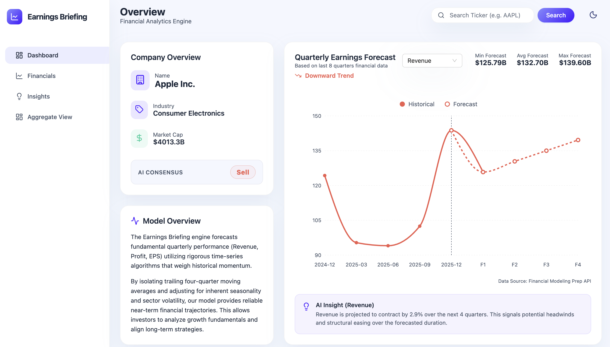
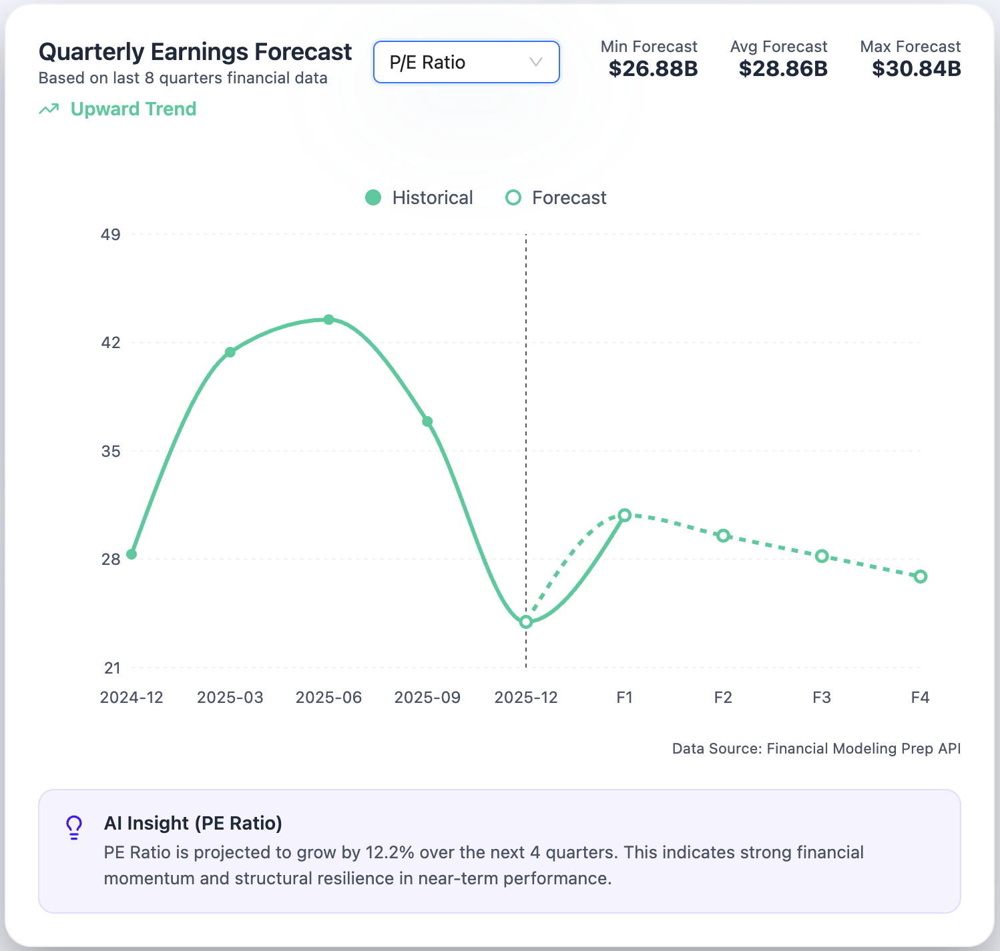
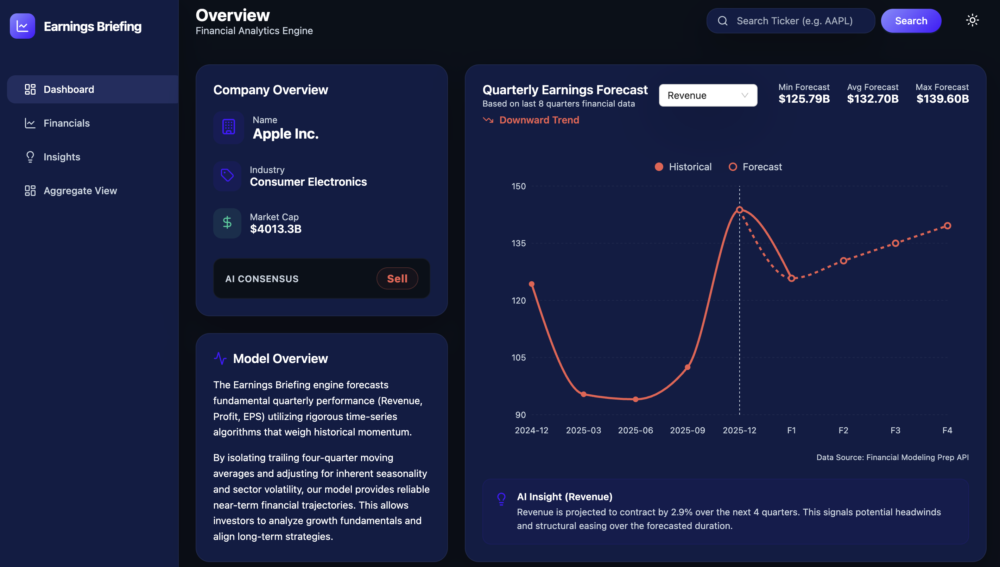

# 📊 Earnings Briefing Engine

AI-Powered Financial Insights & Report Generation Platform
<p align="center">
  
  
  
  
  
</p>

# 🚀 Overview

The Earnings Briefing Engine is an AI-powered system that automates the process of analyzing financial data and generating structured earnings reports.

It collects, processes, and transforms raw financial inputs into clean, readable, and insightful summaries, helping users make faster and smarter decisions.

# ✨ Features
	•	📊 Automated earnings report generation
	•	🧠 AI-powered insights & summarization
	•	📥 Data fetching & processing pipeline
	•	📝 Markdown-based report rendering
	•	⚡ Fast API backend (FastAPI)
	•	🌐 Interactive frontend interface

# 🏗️ Project Structure
```bash
Earnings_Briefing_Engine/
│
├── app/                        # Core backend logic
│   ├── builder.py              # Report builder
│   ├── config.py               # Configuration
│   ├── data_fetcher.py         # Data collection
│   ├── fmp_client.py           # API client
│   ├── plotter.py              # Data visualization
│   ├── render_markdown.py      # Report rendering
│   └── server.py               # FastAPI server
│
├── frontend/                   # Frontend application
│   ├── src/
│   ├── public/
│   ├── index.html
│   └── package.json
│
├── output/                     # Generated reports
├── venv/                       # Virtual environment
│
├── run.py                      # Main entry point
├── requirements.txt            # Python dependencies
├── .env                        # Environment variables
└── README.md
```
# 🛠️ Tech Stack

### 🧠 Backend
	•	Python
	•	FastAPI
	•	Uvicorn

### 🎨 Frontend
	•	JavaScript
	•	HTML/CSS

### 🤖 AI & Data
	•	Financial APIs (FMP)
	•	Data processing pipelines


# ⚙️ Quick Setup (One Copy 💯)

### 🔹 Clone repo
git clone https://github.com/your-username/Earnings-Briefing-Engine.git
cd Earnings-Briefing-Engine

### 🔹 Setup virtual environment
python3 -m venv venv
source venv/bin/activate   # Mac/Linux
### venv\Scripts\activate    # Windows

### 🔹 Install dependencies
pip install -r requirements.txt

### 🔹 Run backend
python run.py

### 🔹 Run frontend
cd frontend
npm install
npm run dev

# 🌐 Usage
	1.	Start backend server
	2.	Start frontend
	3.	Open browser
	4.	Input financial data
	5.	Get AI-generated earnings report

# 📸 Screenshots

### 🏠 Dashboard Overview


### 📈 Earnings Forecast Visualization


### 🌙 Dark Mode Interface


### 🔗 Multi-Company Comparison


# 🚀 Future Enhancements
	•	📈 Advanced financial analytics
	•	🤖 More AI-driven insights
	•	🌍 Multi-company comparison
	•	📊 Interactive dashboards


# 🤝 Contributing
	1.	Fork the repo
	2.	Create a branch
	3.	Commit changes
	4.	Open PR

# 📄 License

MIT License

# 👨‍💻 Author

Vaibhav
Full Stack Developer

# ⭐ Support

If you like this project, give it a ⭐ on GitHub!
